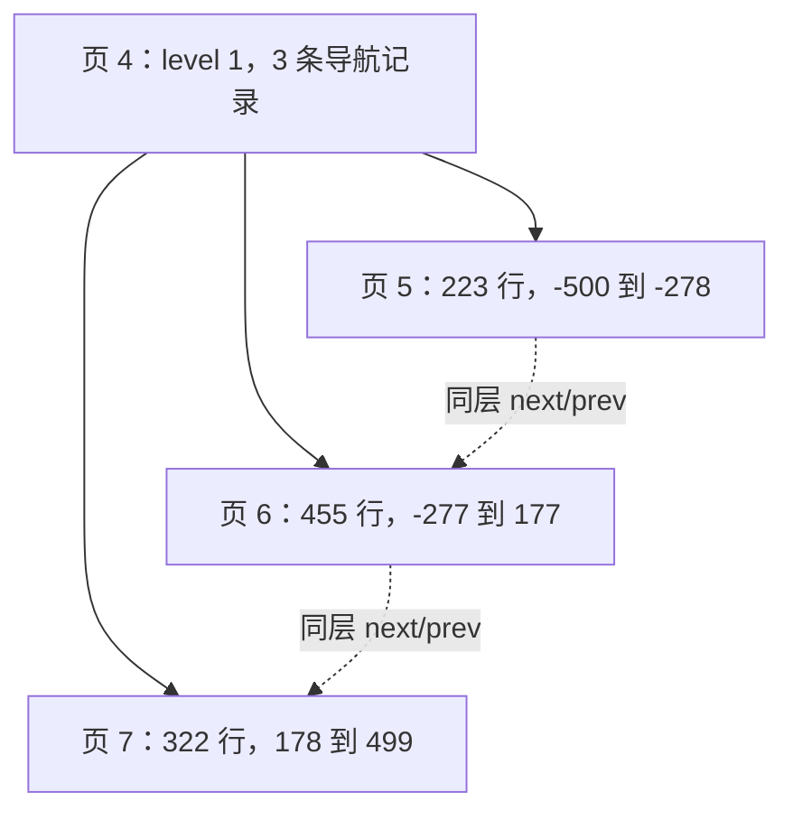

# 06. 表变大后，记录如何分布到索引树

学习目标：从第一阶段的单叶子页扩展到真实多层 B+ 树，区分父子指针、同层页链和文件物理顺序。先读第 02–04 章。本章样本来自 MySQL 8.0.45 的 `testdata/trees/`，不是合成树。

<a id="1-延续原表而不是先增加类型"></a>

## 延续原表，而不是先增加类型

`ordered_rows` 和 `shuffled_rows` 沿用 id INT 主键、可空 score INT 和 name VARCHAR(32)。分别按主键顺序插入 1000 行、使用固定随机种子打乱后插入 1500 行。NULL 与中文仍保留，验证跨页后原有列解码没有变化。

为稳定产生第三层，`deep_rows` 使用 12000 行，列为 id INT 和八个非空 utf8mb4 VARCHAR(63)。每个字符串存 63 个 😀，即 252 字节。单行约 2046 字节：8 个长度字节 + 5 字节头 + 4 字节主键 + 13 字节系统字段 + 8×252 字节数据。它们仍全部位于页内，没有引入 LOB。

<a id="2-实际树形"></a>

## 实际树形

| 样本 | 行数 | 根页号 | 根 level | 各层页数 | 索引总页数 |
|---|---:|---:|---:|---|---:|
| ordered_rows | 1000 | 4 | 1 | level 1: 1；level 0: 3 | 4 |
| shuffled_rows | 1500 | 4 | 1 | level 1: 1；level 0: 4 | 5 |
| deep_rows | 12000 | 4 | 2 | level 2: 1；level 1: 2；level 0: 1715 | 1718 |

level=0 是叶子层；根 level=2 表示从根到叶子有两条边，实际有三层。`.ibd` 中还包含管理页、SDI 和已分配空间，因此索引页数不等于文件页数。

顺序样本的完整树：



根页中的三条记录不是用户行，每条导航记录负责一个子树范围。扫描应只输出叶子记录。

<a id="3-文件页号不等于逻辑顺序"></a>

## 文件页号不等于逻辑顺序

乱序样本的叶子链是 `5 → 8 → 6 → 7`，并不是页号递增：

| 叶子页 | 行数 | 主键范围 |
|---:|---:|---|
| 5 | 364 | −750 到 −387 |
| 8 | 350 | −386 到 −37 |
| 6 | 380 | −36 到 343 |
| 7 | 406 | 344 到 749 |

页分裂时分配出来的新页，其物理位置不一定紧挨逻辑前驱。若简单按文件偏移枚举所有 INDEX 页再拼接，既可能顺序错误，也可能混入其他索引或不属于当前树的残留页。

这正是本阶段采用根页 DFS 的原因：由根页决定哪些页属于要读取的树，由记录链决定键顺序。另用同层 prev/next 链检查遍历结果是否一致，而不是把页链当作未验证的唯一依据。

<a id="4-三层树的实际入口"></a>

## 三层树的实际入口

`deep_rows` 的树上部：

```text
页 4，level 2
  ├─ MIN_REC → 页 37，level 1，601 条导航记录
  │              ├─ MIN_REC → 页 5
  │              ├─ 键 3 → 页 6
  │              ├─ 键 10 → 页 7
  │              └─ …最后键 4196 → 页 632
  └─ 键 4203 → 页 38，level 1，1114 条导航记录
                 ├─ 键 4203 → 页 633
                 ├─ 键 4210 → 页 634
                 └─ …最后键 11994 → 页 1746
```

所有最下面的子页都是 level 0。中间页包含更多子指针，而不是将用户行原样再存一份；非叶子记录通常远小于叶子行，因此能指向很多页面。

<a id="5-插入也可能产生-freegarbage"></a>

## 插入也可能产生 free/garbage

第一阶段小表的堆没有残留记录，因此检查 `heap_count = records + 2`。这个限制在大表中失效。顺序样本页 5 的真实数据为：

```text
PAGE_N_HEAP = 448（不含 compact 标志位）
PAGE_N_RECS = 223（活动用户记录）
PAGE_FREE = 7644
PAGE_GARBAGE = 7469 字节
```

活动记录 223 条，free 链另有 223 条，再加两个系统记录，正好 448。页分裂后部分数据移到其他页，旧页会留下可复用的记录空间；这不要求用户执行 DELETE。

`decodePage` 现在分别处理：

1. 从 infimum 到 supremum 的活动链：解码并返回行或导航记录。
2. 从 PAGE_FREE 到 0 的 free 链：验证 origin、heap number、循环以及与活动记录头的冲突，不解码其中用户值。
3. 核对两条链包含的堆记录数加二与 PAGE_N_HEAP 一致。

这不是实现删除历史恢复。活动链中带 delete/instant/version 标志的记录仍拒绝；free 记录不会被当作 SQL 行返回。PAGE_GARBAGE 只作基本范围和一致性检查，不宣称按残留字段重算全部垃圾字节。

<a id="6-夹具体积和复现"></a>

## 夹具体积和复现

深树的原始 `.ibd` 是 37748736 字节；交付的 gzip 为 215870 字节。压缩是测试资产的无损打包方式，不是 InnoDB COMPRESSED 行格式。Go 解析器仍读取原始 16 KiB 页。

`manifest.json` 记录哈希、实际树高和 SQL 行数；`generate.sql.gz` 保留真实执行 SQL。生成脚本 `--tree` 会检查根层级，不满足预期就失败，不能把行数多当作已经产生第三层。

```sh
go test -run TestTreeFixtures -v .
```

日志应出现 `deep_rows` 的 `levels=map[0:1715 1:2 2:1]` 和 `rows=12000`。实现入口：`tree.go/Read`、`page.go/parseIndex`、`record.go/decodePage`。

格式参考：[MySQL 8.0.45 page0types.h](https://github.com/mysql/mysql-server/blob/mysql-8.0.45/storage/innobase/include/page0types.h)，包括 PAGE_LEVEL、PAGE_FREE、PAGE_GARBAGE 与 PAGE_N_HEAP。
