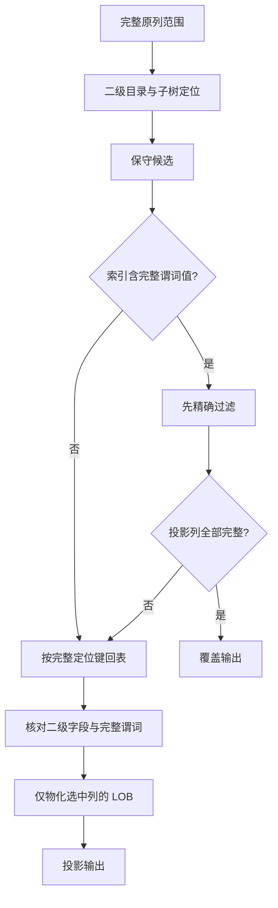

# 73. 二级查询：导航、完整值谓词与覆盖

本章接续[二级物理布局](71-secondary-record-layout.md)和[聚簇查询](69-key-query-navigation.md)。目标是让二级索引直接定位候选，再返回指定列；查询参数描述完整原列值，不把索引前缀当完整值。

## 查询键与物理键

`SecondaryQuery.Range` 沿用 `KeyRange`，只接收二级索引声明成员，不要求附加聚簇定位后缀。`PointKey` 返回全部同值当前项；`Prefix` 表示完整前导列等值，不是字符串 LIKE。上下界按成员各自 ASC/DESC 比较，支持开闭和无界；下界大于上界、或相等边界中含开端点的空范围成功返回零行。nil 边界表示无界，键中的 nil 成员则是索引 NULL：ASC 时最小，DESC 时最大。这是确定的索引比较，不是 SQL 三值逻辑。

返回顺序是二级完整物理键顺序，包含聚簇定位后缀。`Reverse` 反转实际树访问和输出顺序，`Limit` 在精确条件匹配且回调成功后计数。前缀索引的输出不等于完整原列的 ORDER BY；例如 `(name(3), rank DESC, id)` 先按截短 name 排序，再按 rank、id 排序。

## 为什么需要保守候选

假设索引为 `(name(3), rank DESC)`，下界原值为 `("abcdef", 5)`。导航只可用 `"abc"` 的整个等价组；不能继续根据 rank 排除项，因为原值 `"abcxyz"` 已在完整 name 上超过下界，其 rank 不应影响这个结论。

实现于[secondary_range.go](../../secondary_range.go)：遇到首个参与边界的前缀字段，就截断导航元组并包含该等价组，之后的成员留给完整值判断。字符前缀按字符截取，二进制前缀按字节截取。两端均采用保守边界，避免漏行；无前缀时直接使用声明列范围定位。目录搜索定位页内区间，非叶节点剪去无关子树。



局部查询仍完整验证每个已访问页的 CRC、链、目录、堆和本地记录结构。范围边缘不要求是整层首尾，未访问页的损坏不归本次查询认证。原整树 ReadSecondary/ScanSecondary 的检查保持不变。

## 完整副本可提前过滤

`testdata/secondary/overlap.ibd.gz` 的 code 前缀之外，还有完整聚簇 code 副本。查询原值 `"ab00050"` 并投影 payload 时，120 个候选中有119个可在索引内排除，只有1次回表。

二级页5、记录 origin1127（文件偏移83047）的13字节为：

```text
61 62 | 61 62 30 30 30 35 30 | 80 00 00 32
 ab   |       ab00050       | signed INT 50
```

前两字节是存储前缀，七字节完整 code 和 INT50 构成聚簇定位。聚簇结果来自页8、origin920（文件偏移131992）。显式 schema 查询实际物理读取页 `[0,5,4,8]`；报告二级页1、聚簇页2、候选120、过滤119、回表1、交付1。即便单条前缀字段看起来足够短，也不因此将其当成完整列；完整副本由 schema 证明。

真实 deep 快照的中间值点查仅读取页 `[0,5,78,178]`，其中页0为表空间头，二级树路径为5→78→178，整棵二级树共182页。返回3个覆盖结果，记录 origin为3834、4762、5690，聚簇键整数成员为946、941、936；没有聚簇页读取。此例证明实际剪枝，而非整树扫描后过滤。

## API 与投影

四个入口位于[secondary_query.go](../../secondary_query.go)：`QuerySecondary`、`QuerySecondaryAuto`、`QuerySecondaryMaterialized`、`QuerySecondaryMaterializedAuto`。显式入口接收聚簇 Schema 和 SecondarySchema；Auto 按索引名从同一 reader 发现元数据。

```go
q := innodb.SecondaryQuery{
    Range: innodb.PointKey(innodb.Key{int32(1)}),
    Columns: []string{"id", "marker"},
}
report, err := innodb.QuerySecondaryAuto(ctx, file, size, "s", q,
    innodb.ScanOptions{}, func(row innodb.ProjectedRow) error {
        fmt.Println(row.Values, row.Covered)
        return nil
    })
```

Columns=nil 选择全部物化列；非nil空数组、重复、未知或 VIRTUAL 列名拒绝。指定顺序即 Values 顺序，报告 Columns 给出对应定义。严格入口拒绝含 VIRTUAL 的表，显式 Materialized 入口允许只读存储值并报告 VirtualColumns，不求表达式。

`ProjectedRow` 不冒充完整 Record：它只返回 Values、Covered、SecondaryPage/Offset、可空 ClusteredPage/Offset，以及完整 ClusteredKey 或 RowID。覆盖结果没有聚簇来源，也不宣称验证过聚簇树。回表时必须找到唯一当前行，并逐项核对二级值（含前缀）；缺失当前行、重复定位或值矛盾返回 ErrCorrupt，不静默跳过。delete-mark 项不作为当前结果，不新增 MVCC 保证。

验收、延迟 LOB 和预算见[第74章](74-projection-and-lookup-validation.md)。
