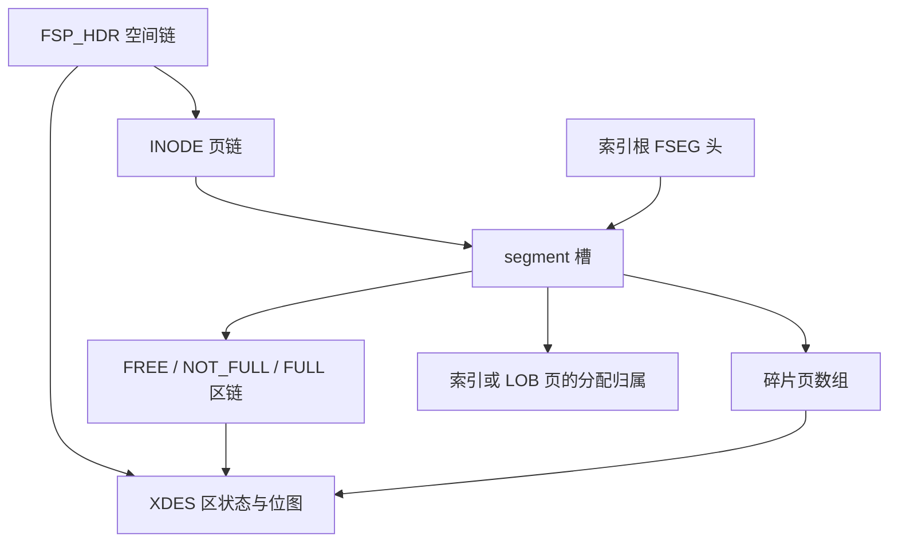

# 75 表空间：页、区、段与分配链

本章接续[二级查询](73-secondary-query-navigation.md)，解释稳定 `.ibd` 中“哪些页仍在使用”。解析入口是[AnalyzeSpace](../../space.go)，它独立于表列类型，不把空闲页中的旧索引内容当成当前索引。

## 四种页状态与三个大小

文件大小除以16384是 `FilePages`；页0的FSP_SIZE是 `SizePages`；FSP_FREE_LIMIT是 `FreeLimit`。三者含义不同。小表可能仅8页，却已初始化第一个64页区的描述信息，所以FREE_LIMIT=64合法。

| Allocation | 范围与依据 | 处理方式 |
|---|---|---|
| used | FSP大小以内，已初始化描述位图标记占用 | 校验CRC/LSN/FIL身份及受支持结构，核对归属 |
| free | 同上，位图标记空闲 | 保存页头观察值，不信任旧页类型/索引身份，不要求残留内容CRC有效 |
| uninitialized | FREE_LIMIT之后、FSP_SIZE以内 | 按FSP定义未初始化分配信息，不能据旧页头认定占用 |
| file-tail | 实际文件存在但超出FSP_SIZE | 单独统计，不归入表空间当前使用量 |

恒等式为 `FilePages = UsedPages + FreePages + UninitializedPages + TailPages`。ZeroPages是内容全零的独立观察计数，可与后三种状态重叠；它不是第五码可相加的分配类别。使用中页全零是错误。

## FSP_HDR与实际字节

FIL头长38字节，FSP头从页0偏移38开始。本阶段仍限MySQL8.0.45、16KiB、非压缩非加密独立表空间，COMPACT/DYNAMIC沿用既有flags校验。

| 文件偏移 | 字节数 | 字段 |
|---:|---:|---|
| 38 | 4 | space ID |
| 42 | 4 | 旧保留字段 |
| 46 | 4 | FSP_SIZE |
| 50 | 4 | FSP_FREE_LIMIT |
| 54 | 4 | flags |
| 58 | 4 | FSP_FRAG_N_USED |
| 62、78、94 | 各16 | FREE、FREE_FRAG、FULL_FRAG链基节点 |
| 110 | 8 | 下一个segment ID |
| 118、134 | 各16 | INODE_FULL、INODE_FREE页链 |
| 150 | 起始位置 | XDES描述数组 |

新empty快照space=819，偏移38的24字节：

```text
00000333 00000000 00000008 00000040 00004021 00000006
space819 reserved size8    limit64  flags    frag_used6
```

文件8页、使用中6页，6/7页为空闲全零。FSP_FRAG_N_USED只统计FREE_FRAG链中的占用页，不是全表空间UsedPages。

链基节点16字节：长度4、首地址6、末地址6。地址是大端页号4＋页内偏移2；页号FFFFFFFF表示空。链节点本身12字节：前地址6＋后地址6。空链检查首末为空；非空链验证长度、前后互指、末端、地址范围、环及重复跨链归属。

empty的FREE_FRAG基节点在78：`00000001 00000000009e 00000000009e`，表示一个节点，地址页0偏移158。158是XDES开始150加节点偏移8，不能把158误当extent的首个数据页。

## XDES：64页一组，两个位一页

16KiB下一个extent有64页，描述长40字节：

| 描述内偏移 | 字节数 | 字段 |
|---:|---:|---|
| 0 | 8 | 存储的segment ID，仅state4/5表示当前整区归属 |
| 8 | 12 | 链节点 |
| 20 | 4 | 状态 |
| 24 | 16 | 64页×2bit位图 |

每页第一位是FREE（1空闲，0占用），第二位是CLEAN。保留CLEAN位，不将它解释成当前事务可见性或额外可分配空间。空闲区里旧segment ID可能仍在，只有状态4/5才能据此关联当前所有者；报告保留存储值供复核。

状态1为空间FREE，必须全空闲；2为FREE_FRAG，部分占用；3为FULL_FRAG，全占用；4是段整区；5是租用给段的碎片区。每个初始化描述必须恰好属于对应空间链或段链，位图计数必须与链种类及汇总一致。

empty描述偏移150：

```text
0000000000000000 | ffffffff0000 | ffffffff0000 | 00000002
segment         | previous     | next         | FREE_FRAG
 aa fa ff ff ff ff ff ff ff ff ff ff ff ff ff ff
```

aa的四组位都是二进制10，即前4页占用且CLEAN=1；fa的低两组10对应页4/5占用，高两组11对应页6/7空闲。描述覆盖的剩余页都空闲，但页8..63不在文件里，不能计入FilePages或可直接读取页数。

描述页覆盖16384个页号（256个extent），位置0、16384、32768……；对应IBUF_BITMAP页在后一页。非首组XDES数组也从偏移150开始。描述/位图页占用所在区的前2页，必须保留。

## INODE与segment

INODE页的链节点位于38，数组从50开始。每项192字节，每页85槽；ID=0表示空槽，不解析其中旧内容。有效项包含ID8、NOT_FULL_N_USED4、三类extent链各16、magic4和32个碎片页号。

magic位于项内60，值97937874（05d669d2）；碎片数组位于64，每项4字节，FFFFFFFF为空。段ID须唯一且小于FSP的下一个ID。INODE页在FREE/FULL页链中的位置必须符合有效槽数。

empty页2偏移50的第一个段ID=1、magic有效，碎片页数组包含页3：它是SDI根的top段。下一项偏移242为ID=2，SDI的leaf段尚无页。页3偏移74的20字节是两个FSEG头：

```text
00000333 00000002 00f2 | 00000333 00000002 0032
space819 inodepage2 242| space819 inodepage2 50
       leaf段ID2      |       top段ID1
```

根页同时是叶页时仍属于top段。不能仅按Level=0就把根归入leaf段。普通索引非根叶页属于leaf段，非叶页属于top段；当前索引ID、根FSEG引用、实际段所有权以及同层链均要一致。

## 状态5的真实租用区

`grown`快照跨过16384页，页16384为XDES、16385为IBUF_BITMAP。它们所在extent的描述地址为页16384偏移150，绝对偏移268435606：

```text
0000000000000004 | 0000400000c6 | 0000400000ee | 00000005
segment4        | previous     | next         | FSEG_FRAG
aaaaaaaaaaaaaaaaaaaaaaaaaaaaaaaa
```

该区64位FREE全0，处于segment4的FULL链。描述的Used=64包含前2个公共元数据页；段的UsedPages/ReservedPages在本区只计其余62页。段NOT_FULL_N_USED的官方存储计数则按该链描述的Used核验（包括租用区保留页），两种计数不能混用。



LOBPages仅表示位于该索引段中的已知LOB类型页数，包含分配但未必属于当前字段值的页；不会据此恢复SQL列、LOB版本或事务状态。

## IBUF_BITMAP

位图载荷从PAGE_DATA=94开始，每个被描述页4bit：FREE class两位、BUFFERED一位、IBUF一位。FREE class按源码 `bit0*2+bit1` 组合，不能当普通两位小端整数。SpacePage.Bitmap暴露使用中页对应的位图观察值；它不能替代XDES分配状态，也不能精确替代页内剩余字节。未初始化/空闲页不输出此使用中页视图。

源码依据为本地8.0.45的`storage/innobase/include/fsp0fsp.h`（FSP/INODE/XDES定义）、`fsp/fsp0fsp.cc`（租用与计数）、`ibuf/ibuf0ibuf.cc`（位图94起点、4bit和两位顺序）、`include/page0types.h`（FSEG头位置）。实际解析见[space_allocation.go](../../space_allocation.go)，验证与指标见[第76章](76-space-analysis-validation.md)。
