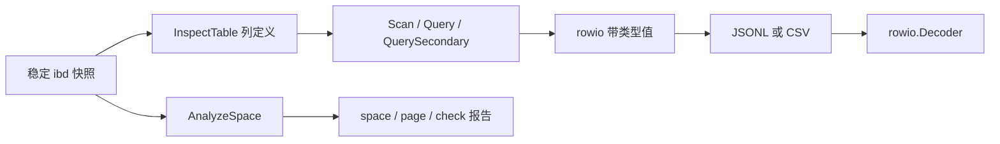

# 77. 从解析 API 到正式命令与无损导出

## 学习目标与前置概念

本章连接第67章流式扫描、第69章聚簇查询、第73章二级查询和第75章空间分析：同一个稳定快照如何成为可复用、可判断是否完整的文件。命令不解析SQL、不连接运行中的MySQL，也不把物理当前记录解释为事务可见性恢复。版本、页大小、字符集及布局仍受既有支持矩阵约束。

第37阶段使用标准库flag/json/csv和现有API。`cmd/innodb-reader`处理信号，`internal/cli`负责参数、读取路径和文件发布，公开`rowio`包负责导出/读回。核心解析器没有复制到命令层。



## 构建与六个命令

在仓库根目录：

```sh
go build -o /tmp/innodb-reader ./cmd/innodb-reader
/tmp/innodb-reader --help
/tmp/innodb-reader metadata testdata/mysql8045/lesson_rows.ibd
/tmp/innodb-reader page --number 4 testdata/mysql8045/lesson_rows.ibd
/tmp/innodb-reader space testdata/mysql8045/lesson_rows.ibd
/tmp/innodb-reader check --scope rows testdata/mysql8045/lesson_rows.ibd
/tmp/innodb-reader export --format jsonl --physical testdata/mysql8045/lesson_rows.ibd
/tmp/innodb-reader export --format csv --output /tmp/lesson.rows.csv testdata/mysql8045/lesson_rows.ibd
```

参数必须放在唯一的ibd路径之前；用`--`分隔以`-`开头的路径。压缩测试资产先解压到临时目录，不能把`.ibd.gz`直接当物理文件。所有输入都必须是稳定快照，不提供在线采集/锁表功能。

| 命令 | 实际API及认证范围 |
|---|---|
| metadata | InspectTable；报告SDI身份、索引入口及Issues，成功不保证可读所有行 |
| page --number N | 完整AnalyzeSpace后选第N页，N从0开始；不是仅检查指定页 |
| space | AnalyzeSpace完整分配/已支持页结构报告，未知使用中页仍保留原始信息 |
| export | Scan，输出当前未delete-mark物化行，完整检查选定聚簇树 |
| query --query spec.json | Query或命名二级索引QuerySecondary，仅认证请求范围/Limit及访问路径 |
| check --scope rows | 默认范围，Scan整表，丢弃行值但返回ScanReport |
| check --scope secondary --index NAME | ScanSecondary选定二级整树，不回表、不认证其他索引 |
| check --scope space | AnalyzeSpace，不解码全部用户字段或LOB值 |

VIRTUAL列仍要求显式`--materialized`（export/query/check rows）；导出仅含实际物化列，schema中的`virtual_columns`保留未求值列。二级查询的`Columns`只输出投影列，绝不补NULL占位。二级物理check本来就不求值非索引VIRTUAL，不接受无作用的materialized选项。

## 查询输入与预算

聚簇点查的`spec.json`：

```json
{"Lower":{"Key":[7],"Inclusive":true},"Upper":{"Key":[7],"Inclusive":true}}
```

```sh
/tmp/innodb-reader query --query spec.json testdata/mysql8045/lesson_rows.ibd
```

范围仍按每列ASC/DESC索引顺序，Reverse只反转访问/输出，Prefix表示完整前导成员等值。大整数直接写JSON整数，命令用UseNumber读取，不能先经过JavaScript浮点数。二进制键写成`{"base64":"AP8="}`。DECIMAL与时间键使用既有规范字符串。文件限1MiB，必须恰好一个对象，未知字段拒绝。

`--index NAME`选择二级查询，输入改为`{"Range":{"Limit":5,"Reverse":true},"Columns":["id"]}`。Columns省略表示所有物化列，空数组、重复、未知或VIRTUAL列拒绝。前缀索引依然按完整原列值解释谓词、保守定位后复核。

扫描命令支持`--cache-pages`、`--max-page-reads`、`--max-entries`、`--max-rows`、`--max-row-bytes`，默认沿用ScanOptions（64页缓存、100万请求/遍历项/行、64MiB单行源字节）。数值0选择库默认值，cache-pages=-1关闭缓存。`--max-rows`是失败预算，查询JSON中的Limit是成功交付上限，两者不同。

为了先输出schema，export/query先InspectTable；其实际读取计入`preflight_reads`，再从页请求预算扣除后交给扫描/查询。stderr的API报告`PageReads`不包含这个独立预检，二者相加是总请求量。二级Auto内部发现、二级导航、回表及LOB继续共享自身累计预算和缓存。SDI容量/解压限制独立，预检不计入用户树MaxEntries。大量逐次回表可能需要显式`--max-entries 10000000`。

空间命令使用独立`--max-pages`（默认100万输入页）及`--space-max-entries`（默认1000万结构项）；page也承担全空间分析成本。不同check范围拒绝显式传入不适用的预算参数。metadata/space/page/check报告沿用库JSON结构，其中整数作为JSON数字；无类型消费者同样需要UseNumber保留精度。

## 版本1：一套值协议，两种记录封装

每个文件的首记录都是schema。以下是真实`lesson_rows.ibd`执行`export --physical`得到的首行：

```json
{"kind":"schema","schema":{"version":1,"columns":[{"name":"id","type":"INT","nullable":false,"max_chars":0},{"name":"score","type":"INT","nullable":true,"max_chars":0},{"name":"name","type":"VARCHAR","nullable":true,"max_chars":32}],"physical":true}}
```

Column保留SQL类型、精度、小数位、字符集、字典、生成表达式等已有字段；未出现的可选字段保持其库零值语义。它描述导出列顺序，不是一份可直接执行的DDL。

| 原库值 | 值单元格（示意） | 读回 |
|---|---|---|
| SQL NULL | `{"type":"null"}` | nil |
| 空文本 | `{"type":"string","value":""}` | string |
| 空二进制 | `{"type":"binary","value":""}` | 非nil空[]byte |
| BIGINT UNSIGNED极值 | `{"type":"uint64","value":"18446744073709551615"}` | uint64，未经float64 |
| DECIMAL | `{"type":"string","value":"123.4500"}` | string；SQL精度由Column保留 |
| FLOAT负零 | `{"type":"float32","value":"-0"}` | float32符号位保留 |
| 任意字节00 FF | `{"type":"binary","value":"AP8="}` | []byte{0,255} |

整数type保留int8/int16/int32/int64及对应uint宽度；复用包也支持Go int/uint和bool。仅允许有限浮点值。文本是UTF-8，JSON负责引号、控制字符和换行转义，不能用表格软件的自动数值推断代替rowio解码。

JSON列用type=json，value是保留kind/binary_type的递归树，标量`scalar`仍为上述单元格，members/elements保留顺序。SQL NULL与`kind=null`节点不同。opaque保存field_type、base64 data以及已有decoded/precision/scale；DECIMAL和时间opaque的解释位于opaque对象，没有虚构普通JSON浮点数。深度100/节点100000上限与库一致，错误类型树拒绝。它不同于JSONValue.JSON()的普通显示视图。

空间列用type=geometry，value保存srid与base64 wkb；读回调用DecodeGeometry重建几何树，保留原WKB字节序、坐标顺序和浮点位值。编码时核对给出的Geometry树与WKB，矛盾拒绝，不做坐标转换。

## JSONL与CSV的记录边界

JSONL每行一个对象：schema → 零或多条row → end。没有物理来源时，示意row为：

```json
{"kind":"row","values":[{"type":"int32","value":"7"},{"type":"null"},{"type":"string","value":""}]}
```

成功结束示意：`{"kind":"end","rows":"4"}`。rows是字符串累计行数。解码器必须读到end，核对计数并确认随后EOF；缺失end、计数不符、尾随记录、截断均报错。end只在底层生产API成功后写出。

CSV第一条记录只有一个单元格，内容是相同schema对象；后续每条记录含固定数量的类型单元格，开启physical则多一列。`encoding/csv`处理外层引号，单元格JSON处理内层类型。例如空文本单元格的外层形式为：

```csv
"{""type"":""string"",""value"":""""}"
```

协议中每条记录占一物理行：数据里的换行已被JSON转义。CSV没有表格标题行，也没有伪装成数据的完成行；空白物理行拒绝，避免吞掉其后数据。**CSV语法EOF不能证明生产过程成功**；保留命令退出状态/stderr，或使用原子发布的`--output`文件。JSONL/CSV末条记录都要求终止换行，默认单条记录（含schema和换行）最多128MiB；Options可调整。这个限制是线协议大小限制，不是进程堆/RSS保证。

## 物理来源与实际字节

`--physical`把Record或ProjectedRow去掉Values后的字段保存为对象；JSONL放在physical属性，CSV放在最后一列。Record下标依然指向物化列，ProjectedRow保留Covered、SecondaryPage/Offset及可选聚簇来源，不制造完整行来源。

真实lesson首行的PageNumber=4、Start=148、Offset=155、End=182；文件绝对Offset位置为`4*16384+155=65691`。Header五字节为`00 00 18 00 43`，它位于记录origin前5字节；Start还包含更前方的变长/NULL元信息。TextBytes[2]为`SW5ub0RC`，base64还原为`49 6e 6e 6f 44 42`，对应InnoDB。页内偏移不能直接当文件偏移。

physical沿用原库JSON字段协议：[]byte为base64、固定字节数组为数值数组、整数为精确JSON数字。Decoder将整个对象保留为json.RawMessage，不经float64；调用者可解到对应Record/ProjectedRow结构。若选择无类型map，必须UseNumber。无physical时不承诺恢复ENUM原序号、SET位掩码、CHAR存储空格或来源元信息。

公开读回例子：

```go
d, err := rowio.NewDecoder(file, "jsonl", rowio.Options{})
if err != nil { return err }
columns := d.Header().Columns
_ = columns
for {
    row, err := d.Next()
    if err == io.EOF { break }
    if err != nil { return err }
    consume(row.Values) // 具体Go类型已恢复，顺序与Columns一致
}
if !d.Complete() { return fmt.Errorf("JSONL未完成") }
```

CSV也用Next循环，但Complete始终为false（没有带内完成认证）。导出端必须检查每次Write错误，仅在生产成功后调用Finish；错误使Encoder失效。两个对象都不关闭调用方流，不支持并发调用。编解码器验证协议形状及值类型，不把外部传入的Column和值组合再次认证为合法InnoDB表。

下一章说明原子文件发布、退出码及如何复现失败。
