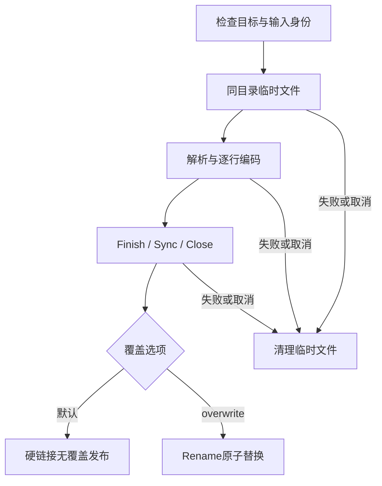

# 78. 命令验收、取消与文件发布

## 学习目标

区分三个成功条件：解析请求成功、导出编码成功、目标文件发布成功。理解stdout流已经发出的前缀不能撤回，并能验证失败没有破坏输入或原输出。本章沿用第77章格式，不扩展支持矩阵。

## 输出与退出状态

stdout只承载请求数据；帮助、参数诊断与最终执行JSON摘要放stderr。摘要包含command、scope、complete、error，以及适用的preflight_reads和API report。API Complete只表示其范围，外层complete还取决于编码、写入及发布成功。

| 退出码 | 含义 |
|---|---|
| 0 | 请求和输出成功；帮助正常显示也返回0 |
| 2 | 命令/参数或查询文件格式错误 |
| 1 | 不支持、损坏、预算耗尽、I/O/编码/发布失败 |
| 130 | context取消或SIGINT/SIGTERM |

断开的输出管道按写错误返回1；main忽略SIGPIPE的默认终止行为，让错误走统一路径。stderr本身写失败也返回非零，但无法保证向坏掉的stderr留下诊断。查询边界不符合实际schema是在运行时发现，返回1；语法错误返回2。

实际lesson_rows导出摘要确认4行、1个聚簇页、预检4次读取、API请求2次。总请求为6，不能只报API的2次。表中的INT值是int32，不是通过JSON float64猜出的类型。摘要的scope不表示SQL事务可见性、整个数据库或未访问索引已验证。

## 文件状态转换



目标默认不能存在；`--overwrite`才允许替换。输入ibd和查询JSON都受同路径、符号链接所指身份及硬链接身份保护。已有目标在解析失败、记录编码失败、写失败或取消时保持原内容；本次临时文件被清理。

默认发布使用os.Link，避免“先检查不存在，再Rename覆盖”之间的竞态。若另一个进程在检查后创建目标，发布失败并保留对方文件。临时文件与目标同目录；文件系统不支持硬链接时返回错误，不静默降级为有竞态的覆盖。覆盖模式使用Rename替换目录项，不追随目标符号链接写入。

这是稳定目录内的单文件原子可见性协议，不是跨文件事务，也不保证断电后的目录持久性；没有对目录执行fsync。临时文件默认为0600，发布后沿用此权限。文件发布后的stderr失败不能撤回已经完成的文件。

stdout没有回滚机制。JSONL失败前可能已有schema和若干row，此时不会发送end；CSV可能正好在完整数据行边界失败，所以必须同时检查退出码。若消费者故意提前关闭管道，也不能把生产者错误当作全量成功。

取消是协作式的：传入context，并在读取/写入/发布阶段检查。任意阻塞ReaderAt/Writer仍不能被强制打断；不会为取消而关闭调用方任意文件。SIGINT子进程验收在观察到真实首字节后发送信号，再继续消费输出，避免阻塞管道掩盖取消。

## 可复现的边界实验

先按第77章构建`/tmp/innodb-reader`，在仓库根目录执行。以下示例使用新临时目录，不覆盖原始资产：

```sh
work=$(mktemp -d)
printf 'original\n' > "$work/result.jsonl"
/tmp/innodb-reader export --max-rows 1 --overwrite \
  --output "$work/result.jsonl" testdata/mysql8045/lesson_rows.ibd
export_status=$?
printf 'exit=%s\n' "$export_status"
cat "$work/result.jsonl"
```

预期退出1，原输出仍为original。换成stdout：

```sh
/tmp/innodb-reader export --max-rows 1 testdata/mysql8045/lesson_rows.ibd \
  > "$work/partial.jsonl" 2> "$work/summary.json"
export_status=$?
printf 'exit=%s\n' "$export_status"
cat "$work/summary.json"
```

这是失败前缀，不能按成功文件使用。预算1不等于“成功导出1行”；要成功取1行，用query的`{"Limit":1}`。编码器不会为预算失败追加end。

输入保护（在临时副本上试验）：

```sh
cp testdata/mysql8045/lesson_rows.ibd "$work/input.ibd"
/tmp/innodb-reader export --overwrite \
  --output "$work/input.ibd" "$work/input.ibd"
```

命令拒绝同一输入身份，在打开输出临时文件之前失败。

## 验证证据与复跑入口

`rowio/rowio_test.go`读取既有487份行资产，经ReadMaterializedAuto获得既有SQL验证过的值，再通过管道流式编码/解码两种格式。484份成功资产各98811行逐值、Go类型、Column及选择的物理来源一致，3份完整读取拒绝基线保持；不生成新的MySQL快照，不把Go输出重新保存成独立SQL预期。

专项测试覆盖整数端点/超过2^53、float32/64位值和负零、NULL/空文本/空字节、DECIMAL尾零、引号/换行/控制字符、多字符集、JSON整数及opaque、GEOMETRY WKB、INSTANT及生成列。协议测试包括逐字节截断、丢失/伪造end、尾随内容、未知类型/字段、非法数值、行宽/物理对象、记录预算和JSON树边界。CSV特意测试中间空白行不能伪装成EOF。

`internal/cli/run_test.go`比较metadata/page/space与库原报告；导出与完整/仅物化API对照，聚簇范围/Reverse/Limit与二级投影查询对照。覆盖所有check范围、VIRTUAL严格拒绝、错误参数/预算、坏stdout/stderr、已有目标、显式覆盖、硬链接/符号链接输入保护、查询文件保护、写入后取消和无覆盖发布竞态。

另取deep_rows快照副本，翻转最后当前行所属页的一字节，让严格CRC32C失败；验证stdout先有row，最终退出1且没有end。只修改临时副本，源夹具不变。子进程测试实际构建正式二进制，验证帮助/用法/正常/预算退出码、运行中的SIGINT和实际关闭输出管道。

```sh
GOCACHE=/private/tmp/innodb-go-reader-stage30-cache go test ./rowio ./internal/cli
GOCACHE=/private/tmp/innodb-go-reader-stage30-cache go test -race -cover -timeout=25m ./...
GOCACHE=/private/tmp/innodb-go-reader-stage30-cache go vet ./...
GOCACHE=/private/tmp/innodb-go-reader-stage30-cache go test ./rowio -run '^$' \
  -fuzz '^FuzzDecoder$' -fuzztime=10s
```

2026-09-28最终结果：全量race通过，核心885.541秒/92.6%；最后修正后rowio全部race148.179秒/89.7%，CLI最终race9.018秒/90.0%。vet通过；最后一轮10秒fuzz预算1223385次执行无失败。

完整回归保留第35阶段大量逐次回表查询，因此明确25分钟进程超时，不修改产品预算。最终执行结果在本阶段TODO和DECISIONS验收条目记录；测试资产原始文件不可修改。

## 代码入口和边界

- `cmd/innodb-reader/main.go`：信号context、SIGPIPE及退出码。
- `internal/cli/run.go`：命令与API映射、预检预算、结果摘要；query.go保留键数值精度。
- `internal/cli/output.go`：文件身份检查、临时文件、原子发布。
- `rowio/rowio.go`：schema/row/end或CSV记录、流式状态、记录上限。
- `rowio/value.go`：逐类型值、JSON类型树和WKB编解码。

导出文件用于程序无损消费库结果，不是普通办公CSV、SQL dump或数据库导入文件。没有提供在线快照、分区集合、MVCC恢复、压缩/加密/多页大小支持；这些边界仍按既有计划分别处理。
