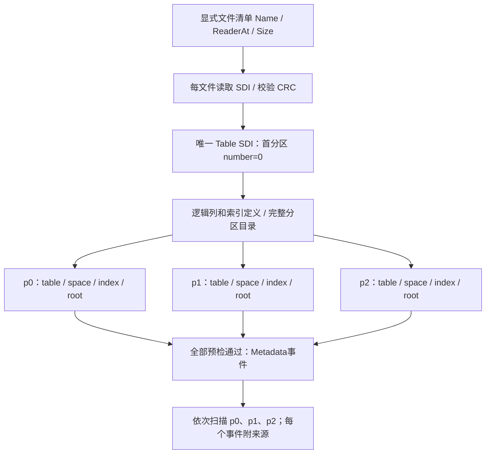

# 79. 分区表：逻辑定义与多个物理文件

<a id="学习目标与前置知识"></a>

## 学习目标与前置概念

理解一张逻辑表为什么需要多个不同身份的表空间，以及怎样从完整文件集合恢复行流。本章建立在[SDI记录](41-sdi-records.md)、[自动schema](43-sdi-schema.md)、[索引根验证](44-metadata-roots-validation.md)和[流式协议](67-streaming-contract.md)上。

第38阶段采用严格完整集合、按分区定义顺序扫描。每个分区内保持聚簇索引序；跨分区不做全局键序归并。首版验证MySQL8.0.45、16KiB、非压缩非加密独立DYNAMIC/COMPACT文件，分区方法为普通HASH、KEY、RANGE、LIST；对应SDI枚举1、3、7、8。LINEAR、COLUMNS、其他KEY枚举和子分区不在本次支持矩阵中。实际列、键、LOB及生成列继续受已有解析器约束。

## 集合中的三种身份



以`testdata/partitions/ranges-*.partition.gz`为贯穿样本：逻辑表`ranges`有三分区，p0、p1各500行，p2为空。Table SDI对象键为`Type=1, ID=1371`，逻辑`se_private_id=18446744073709551615`是哨兵，不能当作物理InnoDB表ID。

| 分区 | number | 物理table ID | space ID | PRIMARY ID / root | s ID / root |
|---|---:|---:|---:|---|---|
| p0 | 0 | 1883 | 821 | 1047 / 4 | 1048 / 5 |
| p1 | 1 | 1884 | 822 | 1049 / 4 | 1050 / 5 |
| p2 | 2 | 1885 | 823 | 1051 / 4 | 1052 / 5 |

三个文件的根页号都是4，但不是同一页。页号和记录偏移必须与PartitionSource一起解释；隐藏DB_ROW_ID也不能独立充当跨分区全局身份。

p0保存Table与Tablespace两个SDI对象，p1、p2各仅保存自己的Tablespace。缺首分区就没有逻辑目录，缺非首分区则目录不完整，两者都失败。不能要求每个文件都有Table对象，也不能把名字含`#p#`当作完整性证据。

## SDI字段如何关联

下面是实际p0主键分区索引对象的关键字段：

```json
{
  "index_opx": 0,
  "se_private_data": "id=1047;root=4;space_id=821;table_id=1883;trx_id=43534;",
  "tablespace_ref": "innodb_reader_partition_9e39b58bcfab/ranges#p#p0"
}
```

PartitionSet.Expression保留原始SDI `partition_expression`。KEY的该字段是DD转义的列名列表：本样本为`n`，而SQL显示及`partition_expression_utf8`是带反引号的列名；不要把原始字段直接当作可执行SQL。官方`sql/dd/dd_table.cc:1318`与`:1492`分别编码字段列表和显示表达式。

`index_opx`是逻辑`indexes`数组的零基位置；0对应PRIMARY，1对应s。逻辑索引保留字段、方向和类型，物理属性为空；分区索引提供自己的ID、根页和表空间。实现要求索引数相同、映射不重复不越界、表空间引用与对应Tablespace相同，再验证真实根页的space/index身份和布局。

所有逻辑列的`se_private_data.table_id`指向首分区：本样本都是1883。它不会随遍历切换为1884或1885。因此内部元数据适配分别保留“共享列的首分区所有者”和“当前分区物理表身份”；普通单文件入口仍按本表ID核对列，不放宽校验。

本地官方MySQL8.0.45源码依据：`sql/dd/impl/types/partition_impl.cc:260–276`序列化分区字段；`partition_index_impl.cc:151–160`保存index_opx和物理属性；`storage/innobase/dict/dict0dd.cc:2649`附近只为首分区写共享列table_id。这些规则同时由真实快照和官方ibd2sdi验证。

## 从实际字节定位p0

样本解压大小475136字节，SHA256：

```text
cdae1fdfb937aebecb36d5a76a7f5dfadba7ad66fa519dbf517031807e00c9c9
```

以下数字均来自该文件；多字节物理整数为大端。页内偏移不是文件绝对偏移，文件绝对位置=`页号 × 16384 + 页内偏移`。

| 位置 | 长度 | 原始十六进制 | 解码 |
|---|---:|---|---|
| 页0 + 34 | 4 | `00000335` | FIL space ID 821 |
| 页0 + 10505 | 4 | `00000001` | SDI物理版本1 |
| 页0 + 10509 | 4 | `00000003` | SDI根页3 |
| 页4 + 64 | 2 | `0001` | 聚簇根level=1，有子页 |
| 页4 + 66 | 8 | `0000000000000417` | 聚簇index ID 1047 |

SDI页3的Table记录origin是448，文件绝对位置49600。记录键起于origin，不包含前面的变长字段和5字节记录头：

| 相对origin | 长度 | 字节 | 含义 |
|---|---:|---|---|
| +0 | 4 | `00000001` | SDI类型Table |
| +4 | 8 | `000000000000055b` | SDI对象ID 1371 |
| +12 | 6 | `00000000aa0e` | 原始事务ID |
| +18 | 7 | `810000011c03e2` | 原始回滚指针 |
| +25 | 4 | `00001eec` | 解压JSON长度7916 |
| +29 | 4 | `00000514` | 压缩载荷长度1300 |
| +33 | 8（前缀） | `789ced595b6fdb36` | zlib压缩流起始 |

origin之前页内441–442的`14 85`是逆向长度数组：靠近记录头的`85`表明双字节，组合得到`0x0514=1300`。解压后才得到JSON里的十进制ID；JSON数字本身没有固定字节偏移，不能把字符串中的数字当作大端整数字段直接读取。

该页的Tablespace记录origin为127，虽然物理位置更靠前，活动链按SDI键先到Table再到Tablespace。应遍历活动链而不是按记录物理地址排序。p1/p2没有Table记录，其页3仅含origin127的Tablespace。

## 预检与流式API

[partition.go](../../partition.go)提供三个入口：

```go
set, err := innodb.InspectPartitions(ctx, inputs, options)
report, err := innodb.ScanPartitions(ctx, inputs, options, yield)
report, err := innodb.ScanPartitionsMaterialized(ctx, inputs, options, yield)
```

inputs为`[]PartitionInput`，每项显式提供`Name`、`Reader io.ReaderAt`、`Size`。输入次序和文件名不决定输出顺序；目录number决定顺序。调用方保证同一受控采集窗口和Reader稳定，负责关闭Reader。

预检拒绝空/重复/额外/缺失输入、重复space、多个Table源、目录矛盾、版本/格式不支持、index_opx冲突、列布局或物理根身份矛盾。Inspect出错返回nil，不返回部分集合。成功集合的`Source`是逻辑SDI键，`Partitions[i].Source`是该物理分区身份；不要混用。

Scan在预检成功后首次回调`PartitionEvent{Metadata: set}`；后续每个事件包含Source和原ScanEvent，可保留回调数据。普通Scan遇VIRTUAL拒绝，只有显式Materialized入口省略VIRTUAL值并报告VirtualColumns，不填伪NULL。

所有文件共用一个scanReader的累计计数。切换文件时清空按偏移缓存的LRU，否则p1页4可能误命中p0页4。页请求、目录/index_opx遍历、用户树遍历和交付行不随分区重置；SDI树另有其既定容量限制。集合最多1024个文件、累计SDI JSON最多64MiB，单SDI对象仍限16MiB。MaxRowBytes等已有单行规则保持。

`PartitionScanReport.Complete`只在所有分区完成后为true；CompletedPartitions只计完整结束的分区。中途损坏、I/O错误、预算耗尽、回调错误、ErrStopped或取消均保留已经交付的前缀并返回错误；预检通过不代表后续所有数据页已检查，也不证明SQL事务可见性。

[下一章](80-partition-validation-and-cli.md)给出命令、生命周期身份变化和验收方法。
