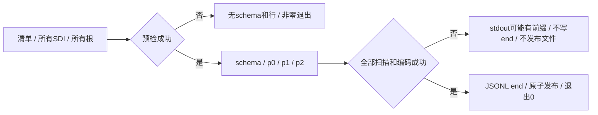

# 80. 分区集合的命令、验证与失败

<a id="学习目标"></a>

## 学习目标与前置概念

使用清单导出完整逻辑表，区分分区顺序和全局键序，验证缺文件、重建后混配和后段失败。前置为[第79章](79-partition-collection-layout.md)及[JSONL/CSV协议](77-cli-and-lossless-export.md)。

## 可直接复跑的离线命令

在仓库根目录执行以下命令。示例只把固定夹具解压到新临时目录，不读取活动MySQL文件：

```sh
go build -o /tmp/innodb-reader ./cmd/innodb-reader
PARTITION_DEMO=$(mktemp -d /tmp/innodb-partitions.XXXXXX)
python3 - "$PARTITION_DEMO" <<'PY'
import gzip,json,sys
from pathlib import Path
out=Path(sys.argv[1]);files=[]
for name in ('p2','p0','p1'):
    raw=gzip.decompress(Path('testdata/partitions/ranges-'+name+'.partition.gz').read_bytes())
    (out/(name+'.ibd')).write_bytes(raw)
    files.append({'partition':name,'path':name+'.ibd'})
(out/'files.json').write_text(json.dumps({'version':1,'files':files}))
PY
/tmp/innodb-reader metadata --manifest "$PARTITION_DEMO/files.json"
/tmp/innodb-reader check --manifest "$PARTITION_DEMO/files.json"
/tmp/innodb-reader export --manifest "$PARTITION_DEMO/files.json" --format jsonl --output "$PARTITION_DEMO/rows.jsonl"
/tmp/innodb-reader export --manifest "$PARTITION_DEMO/files.json" --format csv --physical --output "$PARTITION_DEMO/rows.csv"
```

清单格式如下，相对路径以清单所在目录为基准。它必须是最多1MiB的UTF-8单个JSON对象，version=1，1..1024项；拒绝未知字段、空名称/路径、重复名称和多余JSON值。文件内容必须是解压后的稳定快照。

```json
{"version":1,"files":[
  {"partition":"p2","path":"p2.ibd"},
  {"partition":"p0","path":"p0.ibd"},
  {"partition":"p1","path":"p1.ibd"}
]}
```

清单给出的次序是p2/p0/p1，实际输出仍为定义序p0/p1/p2。`metadata`输出完整集合元数据；`check`使用聚簇行扫描，报告完整分区数和累计计数。`--manifest`只用于metadata/export/check且与单文件位置参数互斥，check只接受rows范围。没有增加集合query、page或space；普通单文件自动行入口仍不能把一个分区当成完整表。

VIRTUAL样本须加`--materialized`；这不会求值表达式。`--max-page-reads`、`--max-entries`、`--max-rows`等沿用现有扫描预算，计入整个集合；具体可用标志见`export --help`。

## 来源封套与顺序

集合导出复用rowio版本1，schema总是`physical=true`。每条行的physical对象必含partition；只有加`--physical`才额外包含原记录来源record（移除Values，避免重复值）。例如p0来源：

```json
{"partition":{"Name":"p0","Number":0,"TableID":1883,"SpaceID":821}}
```

Values依旧只有SQL物化列，不能往列数组插入一个虚构“分区列”。JSONL和CSV的来源形状相同，CSV最后一个单元格为这个JSON对象。来源中的大整数按原元信息JSON规则表示，非类型map消费应使用UseNumber。

实测ranges导出顺序在分区交界处从`(id=989,n=9)`跳到`(id=10,n=10)`。两分区内分别有序，这个交界证明整体不是`ORDER BY id,n`。全表SQL只能作完整多重集合对照；逐分区SQL按同样键排序后逐值比较。需要全局排序的消费方必须另行处理，本阶段没有内置归并。

空集合指逻辑表所有分区都无行，仍必须提供目录里的全部文件。range_empty有三个空分区，JSONL输出schema后跟`end rows="0"`；CSV只有schema记录，仍须检查退出状态。

## 失败何时发生



删掉清单中的p2，即使它是空分区，也会在输出schema前失败。缺首分区、文件中混入另一个表、同一个物理文件冒充两个名字、旧根身份与新目录不一致也在预检拒绝。

`--max-rows 501`会在p0的500行后、p1的第1行交付后耗尽预算：stdout可能保留501行，JSONL没有end，最终非零退出。CSV没有完成尾行，EOF无法证明成功。使用`--output`时，失败会删除本次临时文件，已有目标即使指定`--overwrite`也保留原内容。清单及所有输入文件都受输出身份保护。

参数/清单格式错误退出2；缺文件、损坏、不支持和预算失败退出1；取消退出130。所有stdout前缀是否可消费由调用方决定，不能因看到部分行就报告“完整逻辑表”。

## 重建与交换的真实证据

RANGE生命周期保持同一个逻辑表名称，根页仍可能为4，但物理身份发生变化：

| 快照 | p0 table / space / PRIMARY | p1 table / space / PRIMARY | 当前行数 |
|---|---|---|---:|
| ranges | 1883 / 821 / 1047 | 1884 / 822 / 1049 | 1000 |
| range_rebuilt（REBUILD p0） | 1905 / 843 / 1091 | 1884 / 822 / 1049 | 1000 |
| range_exchanged（EXCHANGE p0） | 1909 / 847 / 1099 | 1884 / 822 / 1049 | 502 |
| range_rebuilt_nonanchor（REBUILD p1） | 1909 / 847 / 1099 | 1910 / 848 / 1101 | 502 |

EXCHANGE后的p0仅有两行；再重建p1时，Table SDI仍在p0更新，共享列所有者仍为1909，p1自己的table ID则变为1910。

最后一份p1的页0+34为`00000350`（848），页4+66为`000000000000044d`（1101）。对照此前p1的space822/index1049，将旧p1与新p0目录混合必须失败。文件名和根页号均无法发现这种变化。

但没有身份变化的不同DML时刻未必能靠SDI发现；相同ID、根页和schema不等于同一事务快照。调用方仍须保证稳定的一致采集窗口，库不会在线锁表或恢复MVCC。

## 独立证据与测试矩阵

[夹具清单](../../testdata/partitions/manifest.json)保存34个文件的解压大小/SHA；[生成脚本](../../scripts/generate_partition_fixtures.py)只操作新唯一库，写入提交后通过FLUSH TABLES FOR EXPORT持锁复制各分区，再解锁。固定SQL行预期与字典结果独立保存；Go解析结果不用于生成预期。

| 集合 | 文件数 | SQL行数 | 覆盖 |
|---|---:|---:|---|
| range_empty | 3 | 0 | 全空表、空分区 |
| ranges | 3 | 1000 | RANGE、多页、LOB、二级根、跨分区非全局序 |
| lists / hashes / keys_table | 各3 | 各30 | LIST / HASH / KEY |
| compact_rows / hidden_rows / virtual_rows | 各2 | 各30 | COMPACT、隐藏ROW_ID、显式物化 |
| sub_rows | 4 | 30（拒绝） | 子分区明确不支持 |
| range_rebuilt | 3 | 1000 | 首分区重建 |
| range_exchanged | 3 | 502 | 首分区交换 |
| range_rebuilt_nonanchor | 3 | 502 | 非首分区重建与旧新混配 |

11组成功集合共3184行，另1组子分区拒绝。34个文件通过官方innochecksum严格crc32；46个SDI对象与官方ibd2sdi逐对象一致。每组表ID/space与INNODB_TABLES对照，每种导出与逐分区SQL完整有序值、全表SQL多重集合对照。

本版本INNODB_INDEXES扫描mysql.indexes并跳过空se_private_data，实际分区SQL索引列表为空。原始空结果保留；物理index/root/space改与官方ibd2sdi的partition_indexes对照，不声称SQL直接核对了这些物理索引。源码入口为`storage/innobase/handler/i_s.cc:5946`及`dict/dict0dd.cc:5964`附近。

可复跑验证：

```sh
python3 scripts/verify_partition_fixtures.py --mysql-bin /path/to/mysql-8.0.45/bin
go test -run TestPartition ./...
go test -run '^$' -fuzz '^FuzzPartitionDirectory$' -fuzztime=10s -parallel=2
go vet ./...
go test -race -cover -timeout=25m ./...
```

[验证记录](../../testdata/partitions/verification.json)包含官方工具和两种格式导出的统计。[partition_errors_test.go](../../partition_errors_test.go)在内存副本重建SDI叶页并重新封装CRC，检验错误版本、目录、映射、列所有者和物理身份；这样能确认错误来自元数据校验，而不是提前被CRC挡住。另覆盖后段页损坏、精确与差一预算、取消、回调所有权、CLI输入保护和原子发布。原有487份普通行资产及空间资产保持独立回归。

复核字节可直接解压并读取，无需Go解析器：

```python
import gzip
from pathlib import Path
b=gzip.decompress(Path('testdata/partitions/range_rebuilt_nonanchor-p1.partition.gz').read_bytes())
assert b[34:38].hex() == '00000350'
assert b[4*16384+66:4*16384+74].hex() == '000000000000044d'
```

## 本轮最终验证结果

全量`go test -race -cover -timeout=25m ./...`通过：核心854.269秒/92.5%，CLI8.602秒/89.1%，rowio150.904秒/89.7%。最终逻辑索引属性边界补充后，分区专项race再次通过（核心4.298秒、CLI2.251秒）；vet通过。FuzzPartitionDirectory十秒预算7119次无失败，其后最后边界的种子race通过。文中解压/清单/metadata/check/JSONL/CSV命令已实际执行，ranges报告3个完成分区、1000行、7个聚簇页、4个导航节点、45次页请求。
