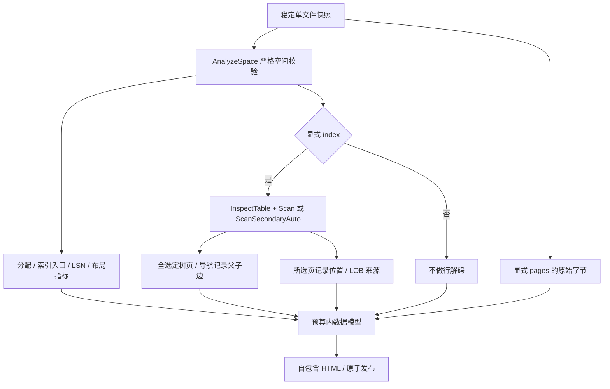

# 81. 离线报告：从空间到索引与字节

## 学习目标与层级

把已有解析结果变成可追溯的图和页详情，并明确图没有验证什么。前置为[页与记录](03-page-to-record.md)、[LOB](13-lob-reference-and-pages.md)、[空间分析](75-space-allocation-layout.md)和[正式CLI](77-cli-and-lossless-export.md)。

用户确认分层报告。默认只做严格空间分析；显式选择一个索引后才完整扫描该索引，并生成真实父子边；显式选择页后嵌入其原始字节，以及选定索引在这些页上的记录和LOB来源。每个请求的层级都必须成功，不会因索引解析失败而自动降级为成功的空间图。



`visual`包不新增物理页解析器。`SpaceIndexPage`只描述局部布局，不提供父子指针；图的Edge必须来自NodePointer/SecondaryNode，不能用页号相邻、同层Previous/Next或根页猜测。图中的树连线与详情中的同层前后页按钮分开。

## API 与保留内容

[visual/report.go](../../visual/report.go)提供：

```go
report, err := visual.Build(ctx, reader, size, visual.Options{
    Index: "PRIMARY",
    Pages: []uint32{0, 4},
})
if err != nil { return err }
return visual.WriteHTML(ctx, output, report)
```

调用方管理Reader与输出流，保证快照稳定。Build任一错误返回nil；WriteHTML写错误可能留下输出前缀，需要原子发布时使用CLI `--output`。

| 层级 | 数据来源 | 报告保留 | 不代表 |
|---|---|---|---|
| 空间 | AnalyzeSpace | 每页分配/已校验标记/头字段、段/区/索引汇总 | 全部索引行/SQL事务可见性已验证 |
| 单索引树 | 完整Scan或ScanSecondaryAuto | 全部访问树页、父子边、原API扫描摘要 | 其他索引也已解码 |
| 所选页记录 | 流式事件 | Start/Origin/End、系统字段、删除/行版本、补值列、LOB来源 | 完整Values导出或删除旧值恢复 |
| 原始字节 | 显式页的ReaderAt读取 | 每页16384字节的十六进制 | 空闲残留也通过CRC/结构认证 |

Report.Space保留空间报告字段，但去掉未知页的Raw自动副本；未知页字节也须显式选择。完整LOB值与Values不嵌入，避免查看一条来源就复制整段大值。ExternalField完整保留Reference、Chunks及COMPACT本地Prefix（最多768字节），它们与所选原始页可以直接核对。

Columns/VirtualColumns/SecondaryFields给出字段定义和物化范围。现有Record API没有普通列逐字段起止偏移，界面不会自行重新解码或猜范围；精确定位涵盖记录边界、20字节页外引用、LOB数据块及索引项起点。INSTANT补值列没有当前记录内的值字节，VIRTUAL也没有伪NULL槽位。

## 页布局与真实字节

贯穿样本`testdata/mysql8045/lesson_rows.ibd`共7页。PRIMARY根页4同时是叶页，space40、index249，四条记录。页4的绝对起点是`4 × 16384 = 65536`。

| 页内位置/范围 | 长度 | 原始字节/含义 |
|---|---:|---|
| +34 | 4 | `00000028`：space40 |
| +40 | 2 | `00ef`：heap top239 |
| +64 | 2 | `0000`：level0 |
| +66 | 8 | `00000000000000f9`：index249 |
| [0,38) | 38 | FIL头 |
| [38,94) | 56 | INDEX头（含段头区域） |
| [94,120) | 26 | 系统记录区域 |
| [120,239) | 119 | heap区域，包含活动记录及可能的垃圾 |
| [239,16372) | 16133 | 连续空闲 |
| [16372,16376) | 4 | 两个目录槽 |
| [16376,16384) | 8 | 页尾 |

空间API返回HeapBytes119、GarbageBytes0、LayoutUsedBytes119。图上布局占用率为`119 / 16384 × 100 = 0.726318359375%`，界面显示0.73%。分母是整页，分子包含物理布局开销；不能把它解释成SQL有效数据占比。heap、垃圾、连续空闲和目录分别显示，原始字段可展开核对。

第一条按键顺序访问的记录在页内`[148,182)`，origin155；它不是该页地址最小的记录。真实字节：

```text
06 00 00 00 18 00 43 7f ff ff fd 00 00 00 00 63 58
81 00 00 00 94 01 1d 80 00 00 2a 49 6e 6e 6f 44 42
```

从Start148起前2字节是变长/NULL元数据，后5字节是记录头，origin155才是首个键字节。文件绝对区间为`[65684,65718)`；origin绝对位置65691。点击记录按钮以Start/End高亮原始字节，不能从Start误读主键。具体键/值布局沿用前面的记录章节，不在可视化层重复实现。

页面同时展示页内十进制偏移、左侧十六进制地址和悬停文件绝对偏移。所有范围左闭右开；点击页目录等布局按钮使用同一套高亮逻辑。

## LSN、树和LOB的读法

LSN直方图只纳入ChecksumVerified的使用中页，按原始整数分箱，显示精确最小/最大值。空闲残留头的LSN不参与“已验证页”分布。它描述页日志位置，不是访问次数、实时热点或事务提交顺序。

树视图围绕当前页展示父页和直接子页，子页超过20个时分页；完整树数据仍保留在报告中。MIN标记来自导航记录，表示继承父范围的最小边界，不是有限用户键。非选定索引页会明确提示没有该树详情；可回根页或输入页号定位。

LOB路径按ExternalField.Chunks的逻辑顺序列出，显示数据页/偏移/长度及LOB索引项页/偏移。不能按物理页号排序。点击数据块高亮其完整区间；索引项按钮只定位起始字节，不声称已高亮整个索引项。没有嵌入字节的页仍可查看空间信息，并提示重新生成时加入`--pages`。

## 精度、安全与资源边界

[visual/render.go](../../visual/render.go)先由encoding/json编码，再用UseNumber把所有JSON数字转成精确十进制字符串。HTML数据里的页号/偏移也因此是字符串；JavaScript仅将受限页号/偏移/计数转成Number，LSN和大ID保持字符串或BigInt。uint64最大值18446744073709551615有明确测试，不能经过float64中转。

html/template转义标题和链接；嵌入JSON由encoding/json转义`<`、`>`、`&`及特殊分隔符，不能用名称关闭script标签。动态文字使用textContent，原始文件字节不会作为HTML执行。报告不加载CDN、不发网络请求，也不启动服务；本地手册链接可用`--manual-dir`配置。

默认空间上限100000页，源ReaderAt累计调用上限1000000次；选定索引沿用ScanOptions自己的请求/遍历/行/单行字节预算。最多显式256个原始页、10000条所选记录详情，嵌入JSON默认最多64MiB。限额超出报ErrLimit，不抽样伪装成完整。JSON上限不含静态HTML框架，也不是进程RSS上限：空间报告、解析中的单行/LOB及编码临时对象都占内存。

DOM按100页、20子页/记录和512字节窗口展示，LOB块展开后按50项加载。这是界面分页，不改变数据或验证范围。取消沿用context协作规则，不能强制打断任意阻塞ReaderAt。

[第82章](82-visual-report-validation.md)给出命令、独立验证和当前浏览器验收状态。
